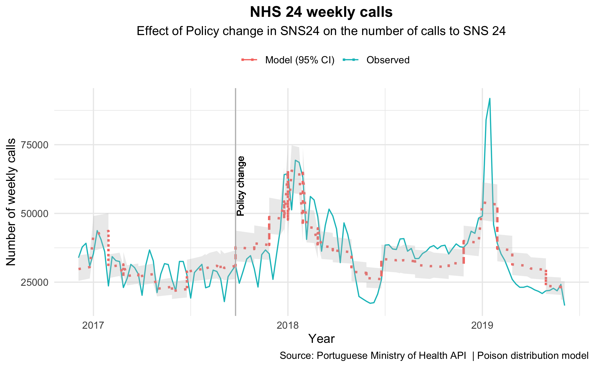
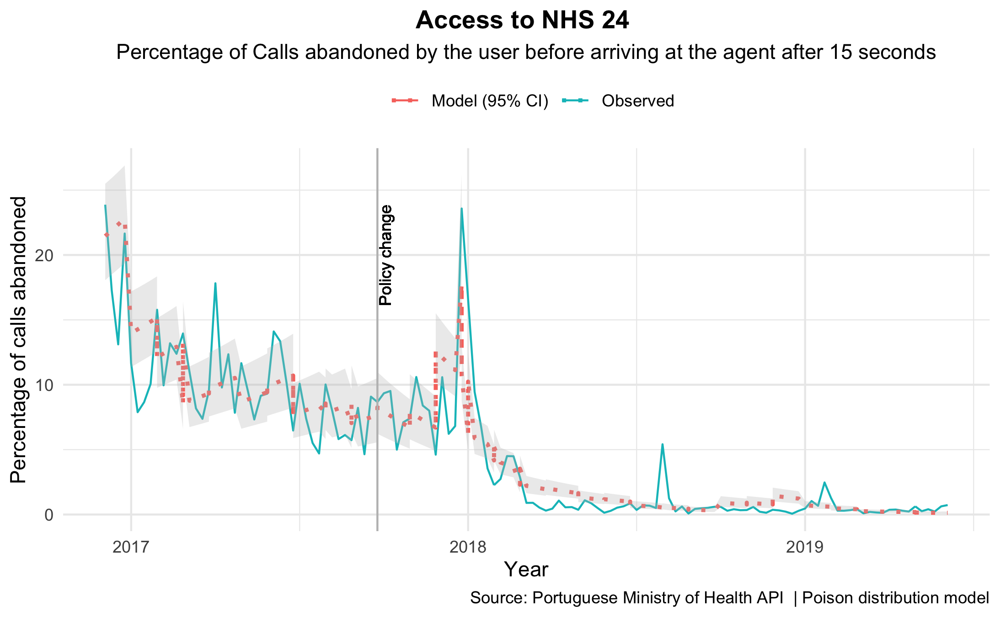

# About Me
.left-column[
**Background**

- MD and Public Health Specialist 
- MPH at ENSP
- Ph.D. (expected 2021/22) at University of Washington  

**Research interests**

- Quantitative Health Policy Evaluation
- Impact of Health Coverage and Insurance Expansion
- Time-Series
- Causal inference (newbie)
- Machine Learning (newbie)


**Telephone Triage Project**
- The project started at the course "Data Science and policy evaluation."
- Code and data are available on GitHub uppon request (private repo)
]


---


class: inverse, center, middle, animated, slideInRight

# INTRODUCTION

---
# Introduction

**Emergency care<sup>1</sup>**
+ Growing demand, which can adversely affect the provider workload and quality of care

--

**Telephone triage system<sup>1</sup>**
+ Improve the appropriateness, 
+ Timeliness, 
+ Quality of care of emergency care 
+ Patient Outcomes

--

**Telephone triage characteristic**
- Nurse-led team 
- Algorithmically-oriented advice, coaching, or A&E service forwarding
- Widespread: United Kingdom, France, Belgium, Australia, and Denmark

.footnote[
.

[1] Organization WH, others. Emergency medical services systems in the European Union: Report of an assessment project co-ordinated by the world health organization-data book. Copenhagen: WHO Regional Office for Europe 2008.
]

---
# Introduction

**Telephone triage systems in Portugal**
+ 1999-2001 Pediatrics-only telephone triage system in the Lisbon area
+ 2002-2007 Expansion all country (mainland)
+ 2008-2016 Expansion to all ages and all country (mainland) _“Saúde 24”_
+ 2017-Present Expansion to allow e-mail contact and online information, appointment scheduling, and other services _“SNS 24”_

--

**Policy intervention**
+ New contractor - maximum budget of 30million euros from 2017-2020 (4 years)
+ Complex system of payment, where some types of calls are more valued than others
+ 10,000 standard calls per can be eligible for payment
+ quality indicators linked with  financial penalties - access and customer satisfaction


---
background-image: url(https://media.giphy.com/media/pPhyAv5t9V8djyRFJH/giphy.gif)
background-position: 50% 50%
background-size: 50%
class: center, bottom, inverse

---
class: middle, animated, slideInRight

# Introduction

**Relevance**
+ Portugal has the highest emergency care visits ration of OECD countries
+ 31.3% of inappropriate emergency care visits
+ Telephone triage can increase efficiency by achieving the same outcomes at a lower cost
 

---
class: inverse, center, middle

# What was the impact on the demand and quality indicators of the Telephone triage service expansion?

---

class: inverse, center, middle, animated, slideInRight

# METHODS

---
# Methods

**Study design**
+ Interrupted time-series analysis
+ Started in December 2016 and ended on July 2019
+ Intervention was rolled up nationally at the same time 

--

**Intervention design and implementation strategy**
1. The services were centralized in a single physical location
2. Email contact was introduced, as well as a dedicated website with information
3. Counseling service for over-the-counter medication
4. Counseling and referencing service for people with HIV and HBV reactive test
5. Administrative services like (scheduling an appointment with a general practitioner, applying for exemption from point-of-care copayments, providing information about surgical vouchers)
6. The supervision of the services changed from the Portuguese Directorate of Health to the Shared Services in the Ministry of Health

--

**September 2017 - deployed service expansion**

---

# Methods

**Data source**
+ SNS 24 and makes publicly available in the “transparency portal.”
+ No missing data
+ Outliers (coincident with the seasonal flu epidemic)

--

**Outcome and variables**
+ Outcome 1. Number of calls answered, 
+ Outcome 2. Percentage of __NOT answered__ calls by the operator within 15 seconds, over the total number of calls received

--

**Data analysis**
+ Before the service expansion (December 2016 and August 2017) 
+ After the service expansion (September 2017 and July 2019)
+ Fixed effects of each month (seasonality)
+ Poison distribution with a link log

$$E(log(Y_t)) = \beta_0 + \beta_{1-12} \sum_{m=1}^{m=12} MONTH_t + \beta_{13} TIME_t + \beta_{14} INT + \beta_{15} TIME_t*INT + log(POP_t) + \epsilon_t$$

---
class: inverse, center, middle, animated, slideInRight

# RESULTS

---
# Results


```{r setup, include=FALSE}
knitr::opts_chunk$set(
  collapse = TRUE,
  warning = FALSE,
  message = FALSE,
  echo = FALSE,
  eval = TRUE
  )
library(kableExtra)
library(tidyverse)
```

```{r, include=FALSE}
library(kableExtra)
library(tidyverse)
```


```{r}
library(readr)

table1_ex <- read_csv("table1_ex.csv")
table1_ex <- as.data.frame(table1_ex)
knitr::kable(table1_ex, 
      caption = "Descriptive analysis Effect of Policy change in Telephone triage [SNS 24]", 
      booktabs = T, 
      digits = 3, 
      format='markdown') %>% 
  add_indent(c(5,6,7,8,9,10,12,13))%>%
  kable_styling(bootstrap_options = c("striped", "hover", "full_width" = F)) %>%
kable_styling(latex_options = "hold_position")   
```

---
# Results

```{r echo=FALSE,  message=FALSE, warning=FALSE}
load("table_m1.RData")
library(tidyverse)

table_m1 <- table_m1 %>%
  dplyr::mutate(term = recode(term, 
     "(Intercept)" = "Baseline weekly n. calls/100.000inh ",
     "time" = "Trend before policy change",
     "int_slope" = "Trend after policy change",
     "start" = "Immediate policy effect")
  )
  
```


```{r}
knitr::kable(table_m1, 
      caption = "Effect of service expansion on the weekly number of calls to SNS 24", 
      booktabs = T, 
      digits = 3,
      col.names = c("Variable",
                    "Estimate",
                    "Low 95% CI",
                    "High 95% CI", 
                    "p Value"),
      format = 'html')  %>%
  kable_styling(bootstrap_options = c("striped", "hover", "full_width" = F)) %>%
kable_styling(latex_options = "hold_position") 
```


---
# Results

.center[

]

---
# Results


```{r}
load("table_m2.RData")

kable(table_m2, 
      caption = "Effect of policy change in SNS24 on percentage of abandoned calls  by the user before arriving at the agent after 15 seconds", 
      booktabs = T, 
      digits = 3,
      col.names = c("Variable",
                    "Estimate",
                    "Low 95% CI",
                    "High 95% CI", 
                    "P Value"))  %>%
  kable_styling(bootstrap_options = c("striped", "hover", "full_width" = F)) %>%
kable_styling(latex_options = "hold_position")   
```
---
# Results

.center[

]

---

class: inverse, center, middle, animated, slideInRight

# DISCUSSION

---
# Discussion

**Summary**
+ 21.6% increase in demand right after the change in policy
+ Decreased at an average rate of 1.2% per week after the policy change
+ Improved quality of service

--

**Interpretation change in demand**
+ Novelty effect and better-informed individuals
+ Substitution effect | Under a constant (true) demand | Improved quality of service
+ Perceived quality and utility is itself a driver of demand
+ Decreasing trend after the service expansion 'wash-out.'

---
# Discussion

**Interpretation change in demand**
+ Durand et al. Patients value more accessibility than the appropriateness of services used
+ Implicit celling to the demand (contract design)

**Limitations**
+ Changes in the Emergency Department's access policies, like co-payments
+ Residual confounding 
+ Seasonality (fixed effects)

.footnote[
.
Durand A-C, Palazzolo S, Tanti-Hardouin N et al. Nonurgent patients in emergency departments: Rational or irresponsible consumers? Perceptions of professionals and patients. BMC research notes 2012;5:525
]
---

background-image: url(https://media.giphy.com/media/Wn74RUT0vjnoU98Hnt/giphy.gif)
background-position: 50% 50%
background-size: 40%
class: center, middle, inverse
---

class: middle, animated, slideInRight
# Follow me

## Twitter: [**@andre_peralta**](https://twitter.com/andre_peralta)
## GitHub: [**aperaltasantos**](https://github.com/aperaltasantos)  
## Website: [**www.aperaltasantos.com**](https://www.aperaltasantos.com/)


